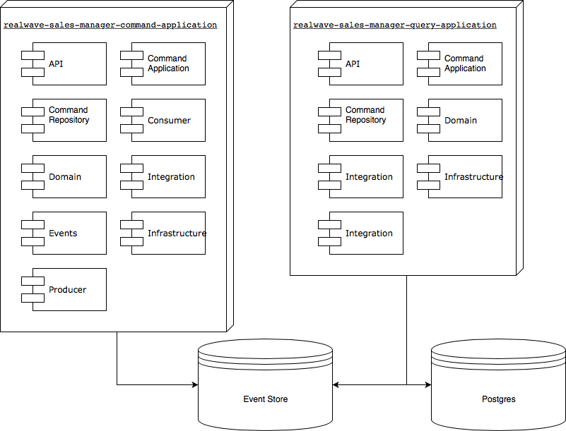

# Realwave Sales Manager (SM)

This project is responsible for managing the sales process, so it receives all the information needed to buy, validates 
it and then ask Customer Order Manager to process the purchase.

This module does not process payments, it does not burn coupons or member-get-member invitations, it does not provision
any resource need, and does not update any resource involved in the sales process.

## Development Environment

You'll need to install:

- **Docker:** https://docs.docker.com/engine/installation/
- **Docker Compose:** https://docs.docker.com/compose/install/
- **Java JDK 8**
- **Maven. Opções para instalação**: 
  - Manual: https://maven.apache.org/install.html
  - http://sdkman.io: `$ sdk install maven`
  - https://brew.sh: `$ brew install maven`
- **IDE**
  - VI: Root Programmer, it should come with your Unix distribution, you're use a Unix right?
  - Eclipse: Nutella Programmer, https://www.eclipse.org/downloads/
  - Intellij: Nutella with Todinho Programmer, https://www.jetbrains.com/idea/download/, if your into Passatempo also,
  consider buying the enterprise version
  
## Build
#### 1. Start docker images

```
$ docker-compose up
```

#### 2. Build

Go to the project root source fold then:

```
$ mvn clean install
```

This will compile, run the unit and maybe integrated tests, and generate the API Rest Documentation


## Deployment Model




## Run

To run the Command module you should have bootstrap-local.properties in the resource folder, go to:
```
realwave-sales-manager-command-application/src/main/resources
```

Copy the bootstrap-local-sample and rename it.
 Then go to the folder:
```
realwave-sales-manager-command-application
```

And run the following command
```
mvn spring-boot:run -Dspring.profiles.active=local
```

To run the Query module you should have bootstrap-local.properties in the resource folder, go to:
```
realwave-sales-manager-query-application/src/main/resources
```

Copy the bootstrap-local-sample and rename it.
 Then go to the folder:
```
realwave-sales-manager-query-application
```

And run the following command
```
mvn spring-boot:run -Dspring.profiles.active=local,postgresql
```

## Test

You can run tests using the Postman but if you're doing it should be a unit test or a integration test onon Cucumber. 
There is a project with collections and environments for Postman and other project for Cucumber, look it up 
on git
